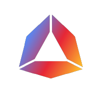

# Andromeda

<figure><figcaption></figcaption></figure>

<table><thead><tr><th>Chain ID</th><th width="218.33333333333331">Version tag</th></tr></thead><tbody><tr><td>galileo-3</td><td>galileo-3-v1.1.0-beta1</td></tr></tbody></table>

| Binary Name | Wasm    | SDK version |
| ----------- | ------- | ----------- |
| andromedad  | Enabled | v0.45.12    |



https://rpc.andromeda.aknodes.net



https://api.andromeda.aknodes.net



grpc.andromeda.aknodes.net:9790


