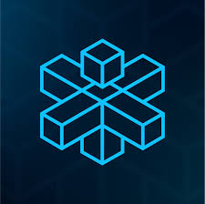

# Crossfi

### Explorer



<table><thead><tr><th>Chain ID</th><th width="218.33333333333331">Version tag</th></tr></thead><tbody><tr><td>crossfi-evm-testnet-1</td><td>v0.3.0-prebuild3</td></tr></tbody></table>

| Binary Name | Wasm     | SDK version |
| ----------- | -------- | ----------- |
| crossfid    | Disabled | v0.47.3     |



https://rpc.crossfi.aknodes.net



https://api.crossfi.aknodes.net



grpc.crossfi.aknodes.net:9090


