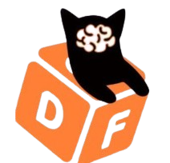

# Dora

<table><thead><tr><th>Chain ID</th><th width="218.33333333333331">Version tag</th></tr></thead><tbody><tr><td>vota-vk</td><td>v0.2.0</td></tr></tbody></table>

| Binary Name | Wasm     | SDK version |
| ----------- | -------- | ----------- |
| dora        | Disabled | v0.47.3     |



https://rpc.dora.aknodes.net



https://api.dora.aknodes.net



grpc.dora.aknodes.net:16990


