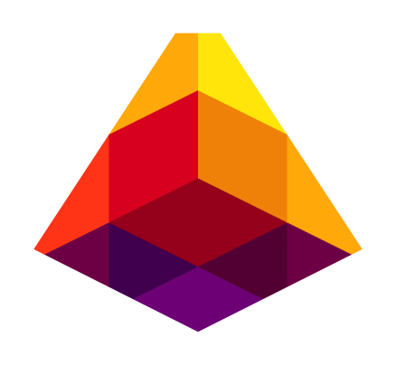

# Lava

<figure><figcaption></figcaption></figure>

<table><thead><tr><th>Chain ID</th><th width="218.33333333333331">Version tag</th></tr></thead><tbody><tr><td>lava-testnet-2</td><td>v1.0.1</td></tr></tbody></table>

| Binary Name | Wasm     | SDK version |
| ----------- | -------- | ----------- |
| lavad       | Disabled | v0.47.3     |



https://rpc.lava.aknodes.net



https://api.lava.aknodes.net



grpc.lava.aknodes.net:17090


