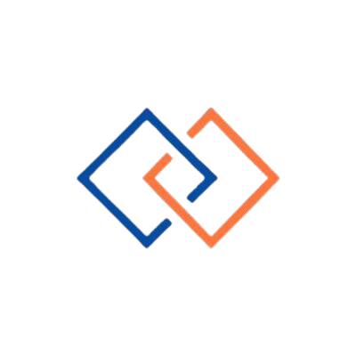

# Axone

## Explorer



<figure><figcaption></figcaption></figure>

<table><thead><tr><th>Chain ID</th><th width="218.33333333333331">Version tag</th></tr></thead><tbody><tr><td>axone-1</td><td>12.0.0</td></tr></tbody></table>

| Binary Name | Wasm    | SDK version |
| ----------- | ------- | ----------- |
| axoned      | Enabled | v0.47.3     |



https://rpc.axone-mainnet.aknodes.net



https://api.axone-mainnet.aknodes.net



grpc.axone-mainnet.aknodes.net:9290


