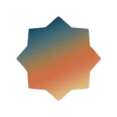

# Haqq

### Explorer



<figure><figcaption></figcaption></figure>

<table><thead><tr><th>Chain ID</th><th width="218.33333333333331">Version tag</th></tr></thead><tbody><tr><td>haqq_11235-1</td><td>v1.7.4</td></tr></tbody></table>

| Binary Name | Wasm    | SDK version |
| ----------- | ------- | ----------- |
| haqqd       | Enabled | v0.46.14    |



https://rpc.haqq.aknodes.net



https://rpc.haqq.aknodes.net



grpc.haqq.aknodes.net:9190


