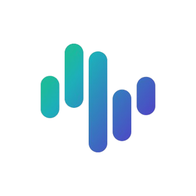

# Zigchain

<figure><figcaption></figcaption></figure>

<table><thead><tr><th>Chain ID</th><th width="218.33333333333331">Version tag</th></tr></thead><tbody><tr><td>zigchain-1</td><td>v2.0.0</td></tr></tbody></table>

| Binary Name | Wasm    | SDK version |
| ----------- | ------- | ----------- |
| terp        | Enabled | v0.53.4     |



https://rpc.zigchain-mainnet.aknodes.net



https://api.zigchain-mainnet.aknodes.net



grpc.zigchain-mainnet.aknodes.net:19090


