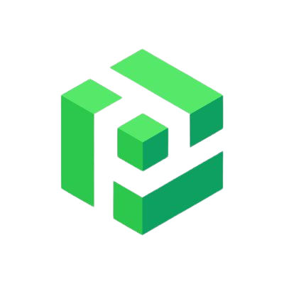

# SAO

<figure><figcaption></figcaption></figure>

<table><thead><tr><th>Chain ID</th><th width="218.33333333333331">Version tag</th></tr></thead><tbody><tr><td>sao-20230629</td><td>v0.1.9</td></tr></tbody></table>

| Binary Name | Wasm    | SDK version |
| ----------- | ------- | ----------- |
| sao         | Enabled | v0.47.3     |



https://rpc.sao.aknodes.net



https://api.sao.aknodes.net



grpc.sao.aknodes.net:49090


